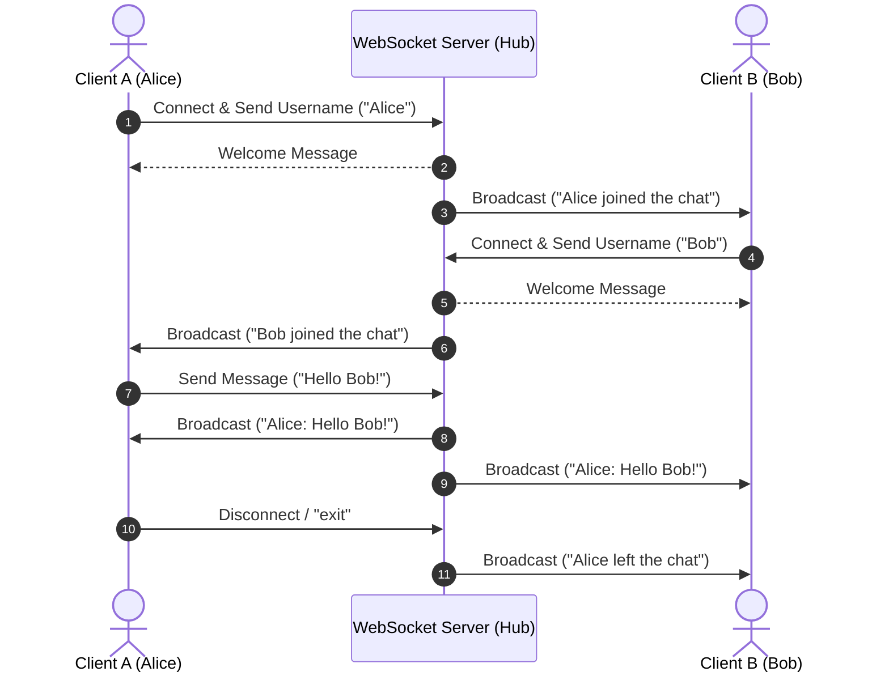

# 🚀 Real-Time WebSocket Chat Room (Go)

A lightweight, concurrent, bidirectional multi-client chat application built in **Go** using the [`gorilla/websocket`](https://github.com/gorilla/websocket) package.

[](https://go.dev/)
[](https://github.com/gorilla/websocket)
[](LICENSE)

---

## 📌 Features

- ⚡ **Real-Time Bidirectional Communication**: Instant message delivery using WebSockets over TCP (`ws://localhost:8080/ws`).
- 👥 **Multi-Client Broadcast Hub**: Thread-safe client connection management using Go's `sync.Mutex`.
- 💬 **Interactive Terminal Client**: Concurrent client CLI supporting asynchronous message receiving while reading user input.
- 🔔 **Presence Notifications**: Automatic broadcast alerts when users join or leave the chat.
- 🛑 **Graceful Disconnection**: Handles client disconnects and clean exits via the `exit` command.

---

## 🏗️ Architecture & Flow



---

## 📂 Project Structure

```text
websocket-demo/
├── client/
│   ├── go.mod          # Client Go module configuration
│   ├── go.sum          # Checksums for dependencies
│   └── main.go         # Terminal client implementation
├── server/
│   ├── go.mod          # Server Go module configuration
│   ├── go.sum          # Checksums for dependencies
│   └── main.go         # WebSocket server & Hub manager
├── .gitignore          # Ignored build binaries and temp files
└── README.md           # Project documentation
```

---

## 🛠️ Prerequisites

Ensure you have [Go](https://go.dev/dl/) (version 1.20 or newer) installed on your system.

```bash
go version
```

---

## 🚀 Getting Started

### 1. Clone the Repository

```bash
git clone https://github.com/utkarsh12377/websocket_demo.git
cd websocket_demo
```

### 2. Start the WebSocket Server

Open a terminal window and run:

```bash
cd server
go run main.go
```

**Expected output:**
```text
Chat server running on ws://localhost:8080/ws
```

---

### 3. Start Chat Clients

Open one or more separate terminal windows to simulate multiple users:

#### **Client 1 (Terminal 2):**
```bash
cd client
go run main.go
```

#### **Client 2 (Terminal 3):**
```bash
cd client
go run main.go
```

---

## 💬 Usage Example

### Client 1 Terminal (Alice):
```text
Connecting to chat server...
Connected to chat server!
Enter your name: Alice

Welcome, Alice
Type messages below.
Type 'exit' to leave.

You: Hi everyone!
Alice: Hi everyone!

Bob joined the chat
Bob: Hey Alice!
You: 
```

### Client 2 Terminal (Bob):
```text
Connecting to chat server...
Connected to chat server!
Enter your name: Bob

Welcome, Bob
Type messages below.
Type 'exit' to leave.

Alice: Hi everyone!
You: Hey Alice!
Bob: Hey Alice!
```

---

## ⚙️ How It Works

### Server (`server/main.go`)
- **HTTP Upgrader**: Upgrades incoming HTTP requests to persistent WebSocket connections.
- **Hub & State Synchronization**: Tracks active client connections safely using a `sync.Mutex` protected map (`map[*Client]bool`).
- **Broadcast Loop**: Iterates across active client sockets to deliver messages concurrently.

### Client (`client/main.go`)
- **Goroutine for Listening**: A background goroutine reads incoming messages continuously from the server and prints them to `stdout`.
- **Main Loop for Input**: The main thread handles interactive `stdin` reading via `bufio.Reader` and writes outgoing messages to the WebSocket connection.

---

## 📄 License

This project is open source and available under the [MIT License](LICENSE).
